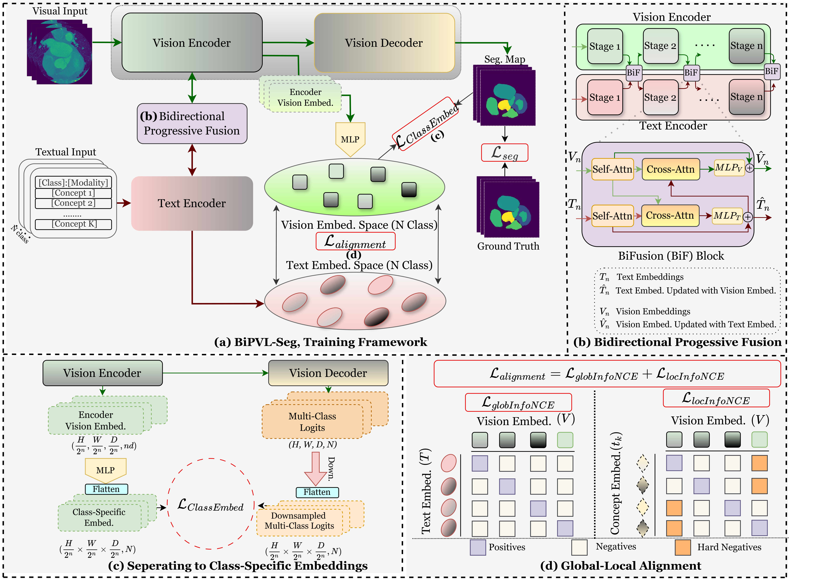

# **BiPVL-Seg**
**Bidirectional Progressive Vision-Language Fusion with Global-Local Alignment for Medical Image Segmentation**  
🔗 **[ArXiv Paper](https://arxiv.org/abs/2503.23534)** 

## 📌Abstract:
<p>
Medical image segmentation traditionally depends on visual inputs alone, neglecting the textual insights that clinicians routinely leverage for diagnosis. Vision-language models seek to bridge this gap; however, most existing methods treat visual and textual features in isolation, leading to suboptimal cross-modal alignment. Simple fusion techniques fail due to the inherent differences between spatial visual features and sequential text embeddings. Additionally, medical terminology deviates from general language, limiting the effectiveness of off-the-shelf text encoders and further hindering vision-language alignment. We propose BiPVL-Seg, an end-to-end framework that integrates vision-language fusion and embedding alignment through architectural and training innovations, where both components mutually reinforce each other to enhance medical image segmentation. BiPVL-Seg introduces bidirectional progressive fusion in the architecture, enabling stage-wise information exchange between vision and text encoders. It further incorporates global-local contrastive alignment, a training objective that enhances encoder comprehension by aligning text and vision embeddings at both the class level (fully anatomical or pathological categories) and the concept level (fine-grained visually observable attributes such as shape, location, and appearance).
</p>



---
(We initially named the project "univila", but later changed it to BiPVL-Seg. So, wherever you see univila in the source code, it refers to our proposed model.)
## **🛠️ Installation**
### **1. Clone the repository**
```bash
git clone https://github.com/rafiibnsultan/BiPVL-Seg.git
cd BiPVL-Seg
```
### **2. Install dependencies**
```bash
pip install -r requirements.txt
```
### **3. Train**
Use dataset_grab and model_grab to fix the dataset and model you want to use.
Train:
```bash
python train.py

```

If you have any questions, fill out this [form](https://docs.google.com/forms/d/e/1FAIpQLSeZrbw9tLkzHKXdMPV1XZ2MUFw7w2XWD8nYy2y8TbPz3cSZpg/viewform?usp=sharing&ouid=108686355141976047341)  or just email me at hm4013@wayne.edu. I will get back to you as soon as possible.

### **Citation**

If you find this work useful, please cite our paper!

```bibtex
@article{sultan2025bipvl,
  title={BiPVL-Seg: Bidirectional Progressive Vision-Language Fusion with Global-Local Alignment for Medical Image Segmentation},
  author={Sultan, Rafi Ibn and Zhu, Hui and Li, Chengyin and Zhu, Dongxiao},
  journal={arXiv preprint arXiv:2503.23534},
  year={2025}
}


